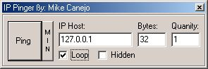



## Mike's Ping Utility

### Description

This pinging utility will allow you to keep a host address alive and will let you be able to quickly see if a person is online by pinging their IP address or even if you wanted to see if a website like www.aol.com or www.planetsourcecode.com was down or up, this would tell you. It also gives you the option of either running the ping window hidden, so this way you can keep a address alive without seeing it doing its junk or getting in the way. Another option it has is that you can loop the ping so it will loop forever until you stop it, if this isn't checked, the windows closes on the third ping. This is a simple program that everyone might understand, I don't expect to get votes for it. I just wrote it out of boredom, so enjoy and ping the hell out of your friends or a website :)
 
### More Info
 
A host address.

If you choose to make it ping in a hidden window, to stop it, press control + alt + delete and end the task on it.

The host address status.

             |
---                |---
**Submitted On**   |2000-11-13 16:17:08
**By**             |[Michael L\. Canejo](https://github.com/Planet-Source-Code/PSCIndex/blob/master/ByAuthor/michael-l-canejo.md)
**Level**          |Intermediate
**User Rating**    |3.6 (25 globes from 7 users)
**Compatibility**  |VB 4\.0 \(32\-bit\), VB 5\.0, VB 6\.0
**Category**       |[Internet/ HTML](https://github.com/Planet-Source-Code/PSCIndex/blob/master/ByCategory/internet-html__1-34.md)
**World**          |[Visual Basic](https://github.com/Planet-Source-Code/PSCIndex/blob/master/ByWorld/visual-basic.md)
**Archive File**   |[CODE\_UPLOAD1165411132000\.zip](https://github.com/Planet-Source-Code/michael-l-canejo-mike-s-ping-utility__1-12763/archive/master.zip)

